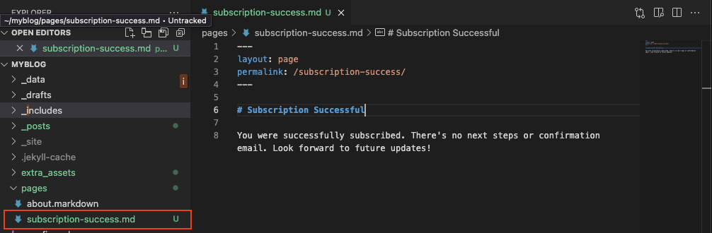
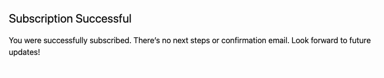
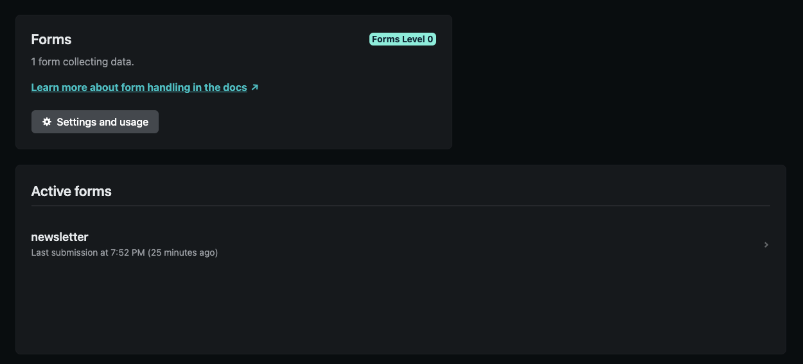
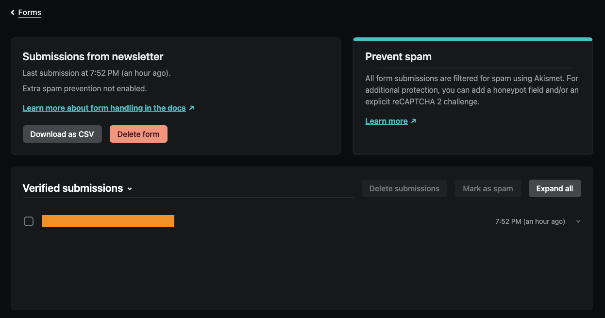

Are you looking for an easy way to add that little box for people to subscribe to your newsletter on your Jekyll website? It shouldn't be that hard to collect some emails right?

Well, it turns out it's a bit harder than expected. A few plug-in services like Mailchimp allow you to embed a subscription box into your website, but that branded watermark really kills the vibe. 

If you search up "How to add a subscription form Jekyll" you might stumble on a few articles that tell you to sign up for XYZ app.

Luckily, if you deployed your website using Netlify, there's an easy way to collect form responses that will show up directly in your Netlify account without having to connect to some shady 3rd-party API.

# Step 0: Deploy your website on Netlify

I know a lot of people like to use Github pages for their Jekyll websites, but I personally find Netlify to be easier to set up and updates are deployed more quickly. 

Sign up for a Netlify account [here](https://www.netlify.com/) (I know, I know, I just complained about signing up for new accounts). Once you're in the dashboard, go to the Sites section to add a new site. You should be able to connect to the Github repo where you stored your website code, and Netlify will automatically re-deploy your website when you push to Github.  

# Step 1: Add an html form to your website

To collect information, you'll need to add an html form to your website. I would recommend adding it to the footer of your site, but you can put it whereever you think is reasonable. If you haven't worked much with html before, here's a code snippet to get you started.

```
<form name="newsletter" method="POST" data-netlify="true">
    <p>
      <input name="email" type="email" placeholder="your@email.com" required>
      <button style="background-color: none;" type="submit">Subscribe</button>
    </p>
</form>
```

Adding `data-netlify="true"` to the `form` html element lets Netlify receive form submissions. Whatever you set as the `name` will be the name of the form that shows up on your Netlify account.

Original Netlify Forms documentation [here](https://docs.netlify.com/forms/setup/).

# Step 2: Create a success page

When users submit an HTML form, they should be redirected to a page that tells them whether or not their subscription succeeded. 

Wherever you store pages in the directory that holds your website code, add a file called `subscription-success.md`. For the Front Matter, make sure to create a permalink to `/subscription-success`. In the content of the page, leave a message that lets the user know their subscription was successful.



<br>
What this looks like on my website:



# Step 3: Link your form to your success page

In the `form` html element of the code snippet, add the attribute `action=/subscription-success"`. This will link the user to the subscription success page we just created after they submit the html form. 

If you gave your subscription success page a different permalink, then make sure to link to that instead.

What your final code should look like:

```
<form name="newsletter" method="POST" action="/subscription-success" data-netlify="true">
    <p>
      <input name="email" type="email" placeholder="your@email.com" required>
      <button style="background-color: none;" type="submit">Subscribe</button>
    </p>
</form>
```

# You're done!

That was easy! Now if you navigate to the forms tab for your website in your Netlify dashboard, you can see the form you created. 



When users submit their email using the form, their submission will show up on Netlify like below.



<br>
Using Netlify forms like this will only allow you to collect emails. If you want a content management platform that will help you distribute your newsletter, you might find a more full-featured platform like Mailchimp to be more appropriate after all.

Good luck with writing online!