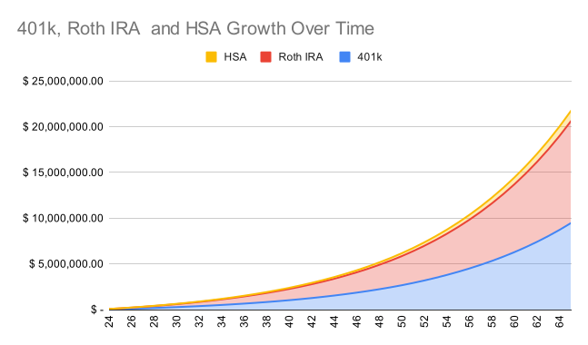

I’ve been thinking about retirement accounts a lot recently. Individual Retirement Accounts (IRAs) are incredible tools to save on tax and build wealth over time, and if you really want to maximize your retirement savings it makes sense to contribute to IRAs as much as possible. 

In the US, some of the most common IRAs are:

- 401(k) (Traditional and Roth)
- Traditional IRA
- Roth IRA
- HSA

The HSA is technically not an IRA. It stands for Health Savings Account, and it’s meant to be used to help people supplement health expenses in conjunction with a high-deductible health insurance plan. But the HSA may very well be the best retirement account of them all, [as explained by the Mad FIentist](https://www.madfientist.com/ultimate-retirement-account/). I won’t go into the details of the benefits of pre-tax vs after-tax IRAs (or both, in the case of HSAs), as that’s easily found on the internet, but I’ve included some sources at the end of this post.

I thought it would be interesting to share projections for what would happen if you maxed your retirement accounts for 40+ years. I chose age 23 as a starting point for contributions, because approximately when most people get their first job out of college.

Maxing out your contributions at age 23 is quite the undertaking. You would need to contribute over \\$60,000 of your money each year! But it wouldn’t actually be unrealistic for many straight-out-of-college tech workers who start out with high incomes (\\$135,000+ TC). And of course, you don’t need to max out these accounts. If you have other priorities in your life like family, travel, or socializing, don’t be afraid to spend on them! We don’t have to min-max every aspect of our lives :)

If you do plan on maxing out your retirement accounts, here’s what your annual contributions would look like at age 23, age 50, and age 55. All contribution limits use 2022 numbers.

|                                | Age 23   | Age 50   | Age 65    |
|--------------------------------|---------:|---------:|---------:|
| 401(k) Pre-Tax Contributions     | $ 20,500 | $ 27,000 | $ 27,000 |
| 401(k) Employer Contributions    | $ 10,000 | $ 10,000 | $ 10,000 |
| After-Tax 401(k) Contributions   | $ 30,500 | $ 30,500 | $ 30,500 |
| Traditional IRA Contributions  |  $ 6,000 |  $ 7,000 |  $ 7,000 |
| HSA Contributions              |  $ 3,650 |  $ 3,650 |  $ 4,650 |
| *Total Personal Contributions*   | $ 60,650 | $ 68,150 | $ 69,150 |
| **Total Contributions**            | $ 70,650 | $ 78,150 | $ 79,150 |

For the sake of simplicity, I’ve assumed a maximum employer 401(k) match of around \\$10,000. 

Notable additions here are the 401(k) After-Tax contributions and Traditional IRA contributions. Most likely, at the income level where you’re maxing out these accounts, you no longer qualify for regular Roth IRA contributions, and thus you would start making use of two backdoors which don’t have income limits. The money from these backdoors would then end up in your Roth IRA.
- **Backdoor Roth IRA:** A non-deductible Traditional IRA to a Roth IRA conversion, which puts you in the same position as if you had been able to contribute to the Roth directly. 
- **Mega-Backdoor Roth IRA:** Only available to you if your employer allows it. If they do, then you can roll over After-Tax 401(k) contributions up to a Roth IRA. Your total 401(k) contributions, including after-tax and employer contributions, cannot exceed \\$61,000 before age 50, and \\$67,500 after age 50.  

At age 50, your Pre-Tax 401(k) contribution limit will increase from \\$20,500 to \\$27,000, and your Traditional IRA contribution limit will increase from \\$6,000 to \\$7,000. At age 55, you’ll be able to increase your HSA contributions from \\$3,650 to \\$4,650.

Now, let’s see what these accounts would look like at a few distinctive points throughout your life, assuming 8% real returns.

|          |   Age 23 |      Age 40 |       Age 60 |       Age 65 |
|----------|---------:|------------:|-------------:|-------------:|
| 401(k)     | $ 30,500 | $ 1,142,232 |  $ 6,827,832 | $ 10,249,390 |
| Roth IRA | $ 36,500 | $ 1,366,934 |  $ 8,058,177 | $ 12,060,104 |
| HSA      |  $ 3,650 |   $ 136,693 |    $ 811,489 |  $ 1,219,623 |
| Total    | $ 70,650 | $ 2,645,860 | $ 15,697,499 | $ 23,529,117 |

At age 23, you only have your contributions, and your accounts total at \\$70,650. To be honest, that’s a pretty incredible amount of savings for only one year. But you haven’t begun harvesting the benefits of compound interest yet.

At age 40, you’ve been contributing for 18 years, and you’ve reaped the benefits of both regular contributions and compound interest, and your accounts would total \\$2,645,859. That’s enough for most people to comfortably retire on.

At age 60, you’ve been contributing for 38 years, and you can start withdrawing from your 401(k) and Roth IRA without penalty (but of course you don’t, for some reason). Your accounts total \\$15,697,499. I’ll say it, you’re rich.

At age 65, you’ve been contributing for 43 years, and you can start withdrawing from your HSA as if it were a traditional IRA. You would be missing out on some of the tax-advantages of the HSA, so it’s not recommended, but it’s still good to have as an option. Your accounts total \\$23,529,117. You probably have enough money to sustain generations of your family now. 

Here’s a graph of how your wealth would grow over time. Note that the compound interest really starts picking up in your 30s. 

Once you’re age 72, you’ll have to start making required minimum distributions (RMDs) from your 401(k). But if for some reason you don’t need the money, there’s [a few ways to limit your RMDs and the tax you pay on them](https://www.investopedia.com/articles/retirement/081916/rmd-strategies-how-avoid-drawing-down-money.asp#:~:text=There%20are%20a%20number%20of,the%20number%20of%20initial%20distributions.). 

In any case, I would imagine most people recognize that at some point in this journey, they probably don’t need to be working anymore. And that point is probably much earlier than the typical retirement age of 65. So if you’re making bank and you’re saving up, take some time to reflect on what you would do with the freedom that comes with that financial independence. Would you start your own business? Donate to charity? Create a trust fund to pay for school for all of your future descendants? Have fun with the possibilities!

And as promised, here are some resources I recommend on retirement accounts:
- [I Will Teach You To Be Rich](https://www.amazon.com/Will-Teach-You-Be-Rich/dp/0761147489) by Ramit Sethi (covers benefits of 401(k), Roth IRA, HSA as well as tons of other helpful personal finance nuggets, the knowledge from this book is worth way more than its cost)
- [Backdoor Roth IRA](https://www.nerdwallet.com/article/investing/backdoor-roth-ira) and [Mega-Backdoor Roth IRA](https://www.nerdwallet.com/article/investing/mega-backdoor-roths-work) conversions by NerdWallet
- [HSA - The Ultimate Retirement Account in 2022](https://www.madfientist.com/ultimate-retirement-account/) by the Mad FIentist
- [Fire Flow Chart Version 4.2](https://www.reddit.com/r/financialindependence/comments/ecn2hk/fire_flow_chart_version_42/) by /u/happyasianpanda (how should you prioritize your contributions?)

