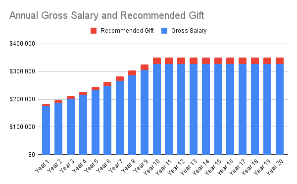

Hey all, earning-to-give is one of my intended ways of contributing to [Effective Altruism (EA)](https://www.effectivealtruism.org/). 

**Intro to EA:**  
> Effective altruism is a philosophy and community focused on maximising the good you can do through your career, projects, and donations.

[This Ted Talk by William MacAskill](https://www.ted.com/talks/will_macaskill_what_are_the_most_important_moral_problems_of_our_time), an Oxford philosophy professor who helped found the EA movement, is an excellent introduction to a few of the core ideas.

Some sobering statistics for those short on time:
- The [majority of people in the world live on less than $3,700 per year](https://ourworldindata.org/extreme-poverty#the-share-of-the-world-population-relative-to-various-poverty-lines). According to [Doing Good Better](https://www.effectivealtruism.org/doing-good-better), If you earn more than $25,000 a year, then globally speaking, you're in the top 1%. This gives you a disproportionate opportunity to make a large impact on the world.
- The [best charities can be 10x better than a typical charity](https://www.givingwhatwecan.org/charity-comparisons) in the same area, and up to 100x better than poorly performing charities.
- Malaria kills 400,000+ people annually. According to GiveWell, a [$5,000 donation to the Against Malaria Foundation can save one life](https://www.givewell.org/charities/top-charities).

Earning-to-give is a strategy motivated by the fact that incomes in developed countries like the United States are so disproportionately high relative to global incomes, that it makes sense for some people to simply work in high-earning jobs and donate their money instead of contributing direct work to different causes.

Working in tech myself, I wanted to see what kind of impact a tech worker could make if they focused only on earning-to-give over a 20-year career.

For this model, I'm using salary data from levels.fyi for a hypothetical SWE working at a top tech company (eg FB, Microsoft, Google). I chose to use SWE data because PM salaries roughly track SWE salaries, but there's far fewer data points available online on PM salaries.

First, I wanted to get a sense of what the salary progression for such an individual would look like. 

According to [Candor](https://candor.co/articles/tech-careers/google-promotions-the-real-scoop-on-leveling-up), it takes 6-9 years to become a senior SWE (L5) at Google. I decided to be conservative and estimated it would take 10 years for an average engineer at a top tech company to become a senior SWE.

Then, I took the average salary of 5 different companies for entry-level SWEs and senior SWEs (of comparable level).

|             | Entry-level SWE (Year 1) | Senior SWE (Year 10) |
|-------------|--------------------------|----------------------|
| FB          |                 $184,311 |             $386,970 |
| Google      |                 $190,443 |             $358,417 |
| Salesforce  |                 $174,913 |             $289,148 |
| Microsoft   |                 $159,124 |             $250,462 |
| Amazon      |                 $168,124 |             $342,335 |
| **Average** |                **$175,383** |             **$325,466** |

Using the averages, to go from an \\$175k to $325k in 10 years, I calculated that an engineer's TC would be growing at about 7.2% per year. I then used the calculator from Peter Singer's [The Life You Can Save Pledge](https://www.thelifeyoucansave.org/take-the-pledge/) to calculate how much an engineer might donate each year for the first 10 years.

|                      | Year 1  | Year 2  | Year 3  | Year 4  | Year 5  | Year 6  | Year 7  | Year 8  | Year 9  | Year 10 |
| -------------------- | ------- | ------- | ------- | ------- | ------- | ------- | ------- | ------- | ------- | ------- |
| Gross Salary         | $175.4K | $188.0K | $201.5K | $216.1K | $231.6K | $248.3K | $266.2K | $285.3K | $305.9K | $327.9K |
| Recommended Gift     | $7.3K   | $8.6K   | $9.9K   | $11.4K  | $12.9K  | $14.6K  | $16.4K  | $18.3K  | $20.3K  | $22.9K  |
| Percentage of Salary | 4.2%    | 4.6%    | 4.9%    | 5.3%    | 5.6%    | 5.9%    | 6.2%    | 6.4%    | 6.7%    | 7.0%    |

From what I understand, going from L5 to L6 is a significant jump, and requires taking on a lot of responsibility that some people would prefer to avoid. Therefore, I decided to just keep the income level at the Senior SWE level for the remaining 10 years of the hypothetical SWE's career.

| Year 11 | Year 12 | Year 13 | Year 14 | Year 15 | Year 16 | Year 17 | Year 18 | Year 19 | Year 20 | Totals   |
| ------- | ------- | ------- | ------- | ------- | ------- | ------- | ------- | ------- | ------- | -------- |
| $327.9K | $327.9K | $327.9K | $327.9K | $327.9K | $327.9K | $327.9K | $327.9K | $327.9K | $327.9K | **$5725.2K** |
| $22.9K  | $22.9K  | $22.9K  | $22.9K  | $22.9K  | $22.9K  | $22.9K  | $22.9K  | $22.9K  | $22.9K  | **$372.1K** |
| 7.0%    | 7.0%    | 7.0%    | 7.0%    | 7.0%    | 7.0%    | 7.0%    | 7.0%    | 7.0%    | 7.0%    | **6.50%**  |

Here's a visualization of income / donations over time:

At the end of their career, the SWE would end up donating \\$372k, or about 6.5% of their $5.7m in career gross earnings.

This also doesn't factor in that many top companies offer donation match programs (\\$5k-\\$10k per year), which would add on another \\$100-200k if you happen to work at one of those companies.

A SWE donating based on numbers given by The Life You can Save Pledge would contribute \\$300-500k+ over the course of their career. If they donate to the most effective charities, they could save 60-100 lives. 

Of course, we all have our obligations and commitments to ourselves, our families, our communites, etc. 

I'm not saying to take this idea to the extreme and donate all your money away. 

But if you're in the very fortunate position where you look at your finances and feel that you have more than enough to be comfortable, happy, and healthy, I encourage you to explore EA and consider whether or not earning-to-give is a strategy you would be interested in as well.

Here are some relevant links again, for convenience:
- [Intro to Effective Altruism](https://www.effectivealtruism.org/articles/introduction-to-effective-altruism)
- [What are the most important moral problems of our time? - Ted Talk by William MacAskill](https://www.ted.com/talks/will_macaskill_what_are_the_most_important_moral_problems_of_our_time)
- [The Life You Can Save Pledge](https://www.thelifeyoucansave.org/take-the-pledge/) from Peter Singer
- [Why and how to earn-to-give](https://80000hours.org/articles/earning-to-give/) from 80,000 hours